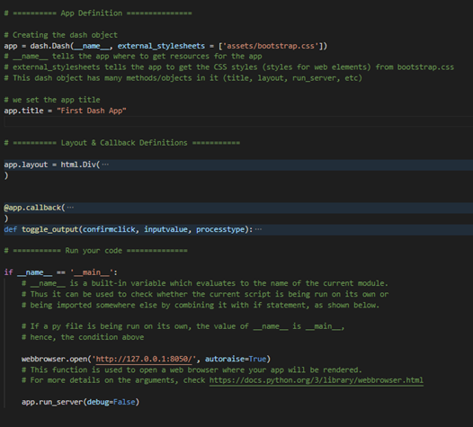
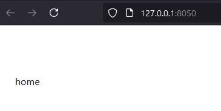
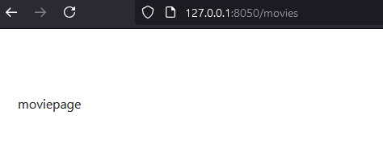
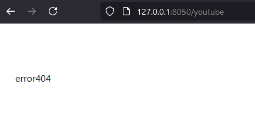
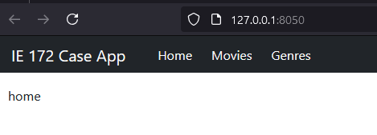

# Module 2b: App Setup
<!-- vscode-markdown-toc -->
* 1. [Preliminaries](#Preliminaries)
	* 1.1. [Requirements](#Requirements)
	* 1.2. [Review](#Review)
* 2. [Create `app.py`](#Createapp.py)
* 3. [Create `index.py`](#Createindex.py)
* 4. [Switching `page-content` using URL](#Switchingpage-contentusingURL)
* 5. [Add scripts to run the server](#Addscriptstoruntheserver)
* 6. [Create `commonmodules.py`](#Createcommonmodules.py)
* 7. [Your App's Landing Page](#YourAppsLandingPage)
	* 7.1. [Setup `home.py`](#Setuphome.py)
	* 7.2. [Import `home` into `index`](#Importhomeintoindex)
	* 7.3. [Revise the URL Callback](#RevisetheURLCallback)

<!-- vscode-markdown-toc-config
	numbering=true
	autoSave=true
	/vscode-markdown-toc-config -->
<!-- /vscode-markdown-toc -->
##  1. <a name='Preliminaries'></a>Preliminaries

For this module, we will be creating a multi-page application. Take note of the following aspects of the source code:
* File Organization -- how we arrange the files needed for the application
* Code Organization -- where scripts are stored and how they are accessed
* Code Management -- how we work with scripts and where we put them
* Callback structures and syntax 

###  1.1. <a name='Requirements'></a>Requirements
For this module, you will need the following:
* Your workspaces with venv configured
* A new folder to store the new app -- will be referred to as `app_folder`. 
* An `assets` folder within the main folder for the app. Make sure to update your copies of `customcss.css`.
* The directories will look like the following: Please add the files needed.
```
app_folder
    |-assets
    |   |-bootstrap.py
    |-apps
    |   |-home.py
    |   |-commonmodules.py
    |-app.py
    |-index.py
```

###  1.2. <a name='Review'></a>Review

The following scripts below show a breakdown of `app.py` from the previous module.



In this module, we will breakdown the contents of this `app.py`into multiple files. 

##  2. <a name='Createapp.py'></a>Create `app.py`

**What is this file for?** Your `app.py` creates the `app` variable and setups the application's desired configurations.

On your blank `app.py`, add the following scripts.

```python
import logging

import dash
import dash_bootstrap_components as dbc
from dash import dcc, html

# Create the application object (stored in app variable), along with CSS stylesheets
app = dash.Dash(__name__)

# Make sure that callbacks are not activated when input elements enter the layout
app.config.suppress_callback_exceptions = True

# Get CSS from a local folder
app.css.config.serve_locally = True

# Enables your app to run offline
app.scripts.config.serve_locally = True

# Set app title that appears in your browser tab
app.title = 'IE 172 Sample IS'

# These 2 lines reduce the logs on your terminal so you could debug better
# when you encounter errors in app
log = logging.getLogger('werkzeug')
log.setLevel(logging.ERROR)
```

##  3. <a name='Createindex.py'></a>Create `index.py`


**What is this file for?** This is the *control center* of your application. This file has the following characteristics. 
* Contains `app.layout` -- the variable that sets the layout of the application
* This file decides which content shows up in `app.layout`

We start the contents of `index.py` with the following scripts. 

```python
import webbrowser

import dash
import dash_bootstrap_components as dbc
from dash import dcc, html
from dash.dependencies import Input, Output, State
from dash.exceptions import PreventUpdate

# Importing your app variable from app.py so we can use it
from app import app

app.layout = html.Div(
    [
        # Location Variable -- contains details about the url
        dcc.Location(id='url', refresh=True),

        # Page Content -- Div that contains page layout
        html.Div(id='page_content', className='m-2 p-2'),
    ]
)

```

##  4. <a name='Switchingpage-contentusingURL'></a>Switching `page-content` using URL
Now, we introduce a callback that does the following action statement:
> If the `url` changes, `page_content` must be updated based on the expected content.

```python
@app.callback(
    [
        Output('page_content', 'children')
    ],
    [
        Input('url', 'pathname')
    ]
)
def displaypage (pathname):
    
    # This code block extracts the id of the triggered input
    ctx = dash.callback_context
    if ctx.triggered:
        eventid = ctx.triggered[0]['prop_id'].split('.')[0]   
    else:
        raise PreventUpdate

        
    # This code block executes action based on the value of eventid
    if eventid == 'url':
        if pathname == '/' or pathname == '/home':
            returnlayout = "home"

        elif pathname == '/movies':
            returnlayout = 'moviepage'

        else:
            returnlayout = 'error404'
    
    else: 
        raise PreventUpdate
    
    return [returnlayout]
    
```

##  5. <a name='Addscriptstoruntheserver'></a>Add scripts to run the server
Do not forget to add a command to run your server. 

```python
if __name__ == '__main__':
    webbrowser.open('http://127.0.0.1:8050/', new=0, autoraise=True)
    app.run_server(debug=False)

```

At this point, you can test your app. Play with the URL paths to test your scripts

 

 



##  6. <a name='Createcommonmodules.py'></a>Create `commonmodules.py`

**What is this file for?** This file contains layouts or callbacks that are common to all modules. This excludes functions useful for all other modules. We will store them in another file called `utilities.py`

To start, let us create here the navbar components -- [see reference here](https://dash-bootstrap-components.opensource.faculty.ai/docs/components/navbar/). 

```python
# Usual Dash dependencies
import dash
import dash_bootstrap_components as dbc
from dash import dcc, html
from dash.exceptions import PreventUpdate

# Let us import the app object in case we need to define
# callbacks here
from app import app

navlink_style = {'color': '#fff', 'margin-right': '1.5em'}

navbar = dbc.Navbar(
    dbc.Container(
        [
            html.A(
                dbc.Row(
                    [
                        dbc.Col(dbc.NavbarBrand("IE 172 Case App", className="ms-2")),
                    ],
                    align="center",
                    className='g-0 me-4'
                ),
                href="/home",
                style={'textDecoration': 'none'}
            ),
            dbc.NavLink("Home", href="/home", style=navlink_style),
            dbc.NavLink("Movies", href="/movies", style=navlink_style),
            dbc.NavLink("Genres", href="/genres", style=navlink_style),
        ], className='m-0 justify-content-start'
        
    ),
    dark=True,
    color='dark'
)
```

Let us now add the navigation bar into `index.py` so that we can see it in the layout. 

1. Import `commonmodules` into `index.py`
    ```python
    from apps import commonmodules as cm
    ```

2. Add `navbar` into `app.layout`. The variable definition now looks like this. 
   ```python
    app.layout = html.Div(
        [
            # Location Variable -- contains details about the url
            dcc.Location(id='url', refresh=True),

            cm.navbar,

            # Page Content -- Div that contains page layout
            html.Div(id='page_content', className='m-2 p-2'),
        ]
    )
   ```

Test your app. Feel free to play with the menu items. 




##  7. <a name='YourAppsLandingPage'></a>Your App's Landing Page

Let us now create a page on your website. For our purposes, each webpage corresponds to one file in your directory. 

###  7.1. <a name='Setuphome.py'></a>Setup `home.py`

On `home.py`, paste the following:
```python
import dash
import dash_bootstrap_components as dbc
from dash import dcc, html
from dash.exceptions import PreventUpdate

from app import app

# instead of app.layout, we just use the variable "layout" here
# We cannot really modify the "app" variable here, we only do it in index.py
layout = html.Div(
    [
        html.H2('Welcome to our app!'),
        html.Hr(),
        html.Div(
            [
                html.Span(
                    "Thru this app, you can manage a database of movies that are classified according to genres.",
                ),
                html.Br(),
                html.Br(),
                html.Span(
                    "Contact the owner if you need assistance!",
                    style={'font-style':'italic'}
                ),
            ]
        )
    ]
)
```

###  7.2. <a name='Importhomeintoindex'></a>Import `home` into `index`

Go to `index.py` and add the following:
```python
from apps import home
```

###  7.3. <a name='RevisetheURLCallback'></a>Revise the URL Callback

We would like to replace the value for `returnlayout` to get the layout from `home`. The conditional on deciding what to display based on the URL should look like the following. 

```python
        if pathname == '/' or pathname == '/home':
            returnlayout = home.layout
            
        elif pathname == '/movies':
            returnlayout = 'moviepage'
            
        else:
            returnlayout = 'error404'
```
* `home.layout` represents the `layout` variable inside the `home` module that we just imported. 

Go ahead and check your work. 