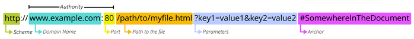
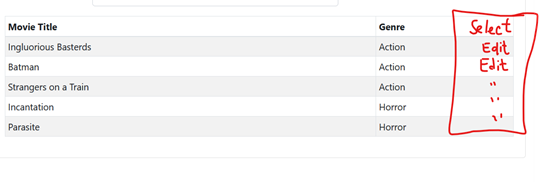

# Module 3a: Setting up the Records List
<!-- vscode-markdown-toc -->
* 1. [Preliminaries](#Preliminaries)
	* 1.1. [What to expect in Module 3?](#WhattoexpectinModule3)
	* 1.2. [Requirements before we proceed](#Requirementsbeforeweproceed)
* 2. [Generate a list of Records at the Movie Management page](#GeneratealistofRecordsattheMovieManagementpage)
	* 2.1. [Add the Callback for the Data Table](#AddtheCallbackfortheDataTable)
	* 2.2. [Add the SQL for the table](#AddtheSQLforthetable)
	* 2.3. [Make the Filter Work](#MaketheFilterWork)
		* 2.3.1. [Add the additional trigger into the callback](#Addtheadditionaltriggerintothecallback)
		* 2.3.2. [Add an additional condition to the SQL WHERE clause](#AddanadditionalconditiontotheSQLWHEREclause)
* 3. [Establishing the Add and Edit Mode](#EstablishingtheAddandEditMode)
	* 3.1. [Parts of a URL](#PartsofaURL)
	* 3.2. [Selecting Movie Records to Edit](#SelectingMovieRecordstoEdit)

<!-- vscode-markdown-toc-config
	numbering=true
	autoSave=true
	/vscode-markdown-toc-config -->
<!-- /vscode-markdown-toc -->
##  1. <a name='Preliminaries'></a>Preliminaries

###  1.1. <a name='WhattoexpectinModule3'></a>What to expect in Module 3?

For Module 3, the edit feature will be added for the movie records. More specifically, the following functionalities will be added to the application by the end of this module:
* Generate an informative list of movies that are currently in the database
* Apply a filter for the generated list of records
* Select a movie record to edit
* Update the records using the app interface

###  1.2. <a name='Requirementsbeforeweproceed'></a>Requirements before we proceed

At this point, you should be able to compile/run the previous case (Module 2c). You should be able to create a new movie record through the app. 


##  2. <a name='GeneratealistofRecordsattheMovieManagementpage'></a>Generate a list of Records at the Movie Management page

In this section, you will be updating `movie_management.py` to add some interactivity and functionalities. 

###  2.1. <a name='AddtheCallbackfortheDataTable'></a>Add the Callback for the Data Table

The first thing to add is the callback for the data table. Copy and paste the following scripts:
```python
@app.callback(
    [
        Output('movie_movielist', 'children'),
    ],
    [
        Input('url', 'pathname'),
    ],
)
def updateRecordsTable(pathname):
    
    if pathname == '/movies/movie_management':
        pass
    else:
        raise PreventUpdate

	# Of course we have to put something to this variable
	movie_table = []
    
    return [movie_table]
```

###  2.2. <a name='AddtheSQLforthetable'></a>Add the SQL for the table

Now, we need to connect to the database so we can get the necessary data. There has to be a proper value for `movie_table`. We need to put the following scripts. 

```python
	sql = """ SELECT movie_name, genre_name, to_char(movie_release_date, 'DD Mon YYYY')
		FROM movies m
			INNER JOIN genres g ON m.genre_id = g.genre_id
		WHERE NOT movie_delete_ind
	"""
	val = []
	col = ["Movie Title", "Genre", "Release Date"]

	df = getDataFromDB(sql, val, col)

	movie_table = dbc.Table.from_dataframe(df, striped=True, bordered=True,
										hover=True, size='sm')
```

###  2.3. <a name='MaketheFilterWork'></a>Make the Filter Work

At this point, we have `movie_titlefilter` waiting for us to incorporate into our code. Do the following to integrate it into the callback that we have been working on so far. The following describes how the text box is interactive. 

> Typing into the text box should immediately update the movie records list. 

####  2.3.1. <a name='Addtheadditionaltriggerintothecallback'></a>Add the additional trigger into the callback

Add the following into the correct location into the code. 
```python
        Input('movie_titlefilter', 'value'),
```
Furthermore, modify the arguments of the function definition. 
```python
def updateRecordsTable(pathname, titlefilter):
```

####  2.3.2. <a name='AddanadditionalconditiontotheSQLWHEREclause'></a>Add an additional condition to the SQL WHERE clause

Modify the following code block so that we can have an additional condition on the WHERE clause if the `titlefilter` is supplied. 

```python
	sql = """ SELECT movie_name, genre_name, to_char(movie_release_date, 'DD Mon YYYY')
	FROM movies m
		INNER JOIN genres g ON m.genre_id = g.genre_id
	WHERE NOT movie_delete_ind
	"""
	val = []

	if titlefilter:
		sql += """ AND movie_name ilike %s"""
		val += [f'%{titlefilter}%']
	
	col = ["Movie Title", "Genre", "Release Date"]
```

At this point, you can test your application. 

##  3. <a name='EstablishingtheAddandEditMode'></a>Establishing the Add and Edit Mode

Note that we are using `movie_management_profile.py` for **both adding and editing** movies. The only difference would be that when we are in **Edit mode**, the movie profile page has pre-filled fields. 

###  3.1. <a name='PartsofaURL'></a>Parts of a URL
We can utilize the URL to tell a page its current **mode**. First, let's check-out the parts of a URL. 



We already use the **path** to indicate the displayed web page in our app. For the mode, we will be using the `parameters` -- also known in other contexts as `search parameters`.

For example, let us modify the `Add Movie` button so that its href has a search parameter to indicate the mode. 

```python
                                dbc.Button(
                                    "Add Movie",
                                    href='/movies/movie_management_profile?mode=add'
                                )
```


###  3.2. <a name='SelectingMovieRecordstoEdit'></a>Selecting Movie Records to Edit

Now, let's add hyperlinks to the records so that we could edit them. 



Start by modifying the SQL to include `movie_id` to the query. We need this reference number for the href of edit buttons. 
```python

    sql = """ SELECT movie_name, genre_name, to_char(movie_release_date, 'DD Mon YYYY'), 
        movie_id
    FROM movies m
        INNER JOIN genres g ON m.genre_id = g.genre_id
    WHERE NOT movie_delete_ind
    """
    val = []

    if titlefilter:
        sql += """ AND movie_name ilike %s"""
        val += [f'%{titlefilter}%']
    
    col = ["Movie Title", "Genre", "Release Date", 'id']

    df = getDataFromDB(sql, val, col)
```


Now, we add the edit buttons. Here's the long way. 
```python
    editButtons = []
    for movie_id in df['id']:
        editButtons += [
            html.Div(
                dbc.Button("Edit", color='warning', size='sm', 
                           href = f'/movies/movie_management_profile?mode=edit&id={movie_id}'),
                className='text-center'
            )
        ]
    
    df['Action'] = editButtons
    
    # we don't want to display the 'id' column -- let's exclude it
    df = df[['Movie Title', 'Genre', 'Release Date', 'Action']]
```

Here's the short way:
```python
    df['Action'] = [
        html.Div(
            dbc.Button("Edit", color='warning', size='sm', 
                        href = f'/movies/movie_management_profile?mode=edit&id={row['id']}'),
            className='text-center'
        ) for idx, row in df.iterrows()
    ]
    
    # we don't want to display the 'id' column -- let's exclude it
    df = df[['Movie Title', 'Genre', 'Release Date', 'Action']]
```

You can now test your work. You should be able to navigate through pages well via the URLs but since we do not have any callbacks yet to deal with the add/edit modes, we cannot see their effects yet. 