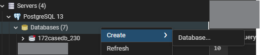
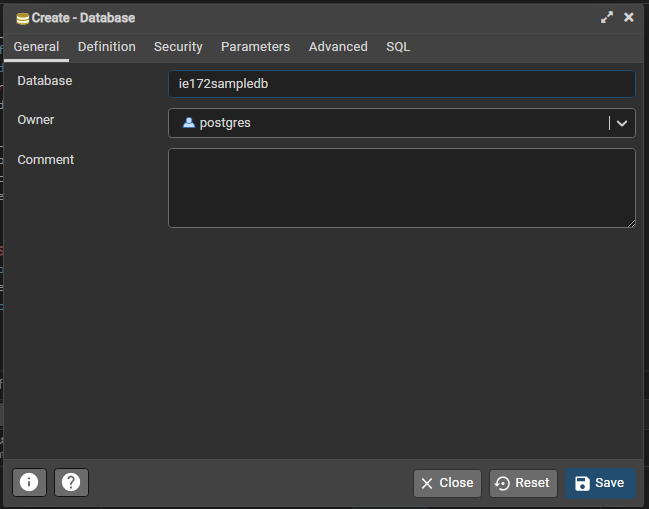
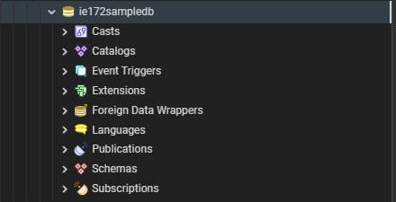
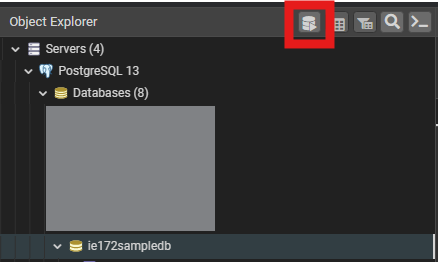
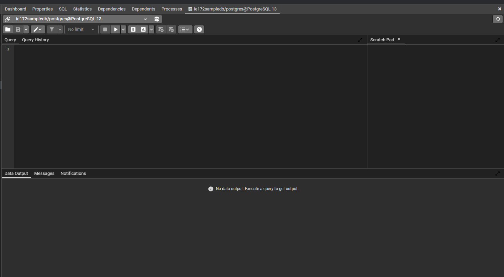
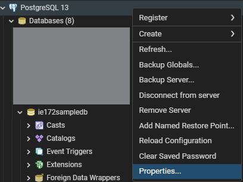
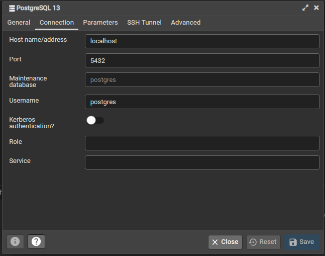

# Module 2a: App and Database Setup

<!-- vscode-markdown-toc -->
* 1. [Preliminaries](#Preliminaries)
* 2. [Database Setup](#DatabaseSetup)
	* 2.1. [Create your Database](#CreateyourDatabase)
	* 2.2. [Create the Tables](#CreatetheTables)
* 3. [App Setup](#AppSetup)
	* 3.1. [Run the Venv](#RuntheVenv)
	* 3.2. [Install Dependencies](#InstallDependencies)
* 4. [Create your API](#CreateyourAPI)
	* 4.1. [Create your `dbconnect.py`](#Createyourdbconnect.py)
	* 4.2. [Use the API to Access the DB](#UsetheAPItoAccesstheDB)
* 5. [SQL Injection](#SQLInjection)
* 6. [Using your API to modify your records](#UsingyourAPItomodifyyourrecords)

<!-- vscode-markdown-toc-config
	numbering=true
	autoSave=true
	/vscode-markdown-toc-config -->
<!-- /vscode-markdown-toc -->

##  1. <a name='Preliminaries'></a>Preliminaries
In module 2, we will be creating a multi-page application with a database backend. Dash will serve as the front-end of this project while Postgresql (pgadmin as interface) will be the backend. Expect some SQL scripts in this module. 

Please ensure that the following are setup before we begin. 
* We will need VS Code and pgadmin (Postgresql) for this session. Make sure you have Postgres and Pgadmin installed -- [use this reference](https://www.postgresql.org/download/) for your installers. 
* For scripts, transfer `app.py` and `app2.py` in a new folder called `archived_apps`. We will not be using these scripts anymore. 
* Ensure that you still have your assets folder. You can download `bootstrap.css` from this git. 

Check the following for the desired setup for your directory:
```
<main folder>
    |
    |- assets
    |   |- bootstrap.css
    |   |- custom.css (optional)
    |- .venv
        |- <various contents>
```


##  2. <a name='DatabaseSetup'></a>Database Setup
Open pgadmin.

###  2.1. <a name='CreateyourDatabase'></a>Create your Database
On the left sidebar, expand on Servers and open the PostgreSQL version that you currently have. Right-click to reveal the option to create a database. 



Fill-in the name of the database as `ie172sampledb`.



Click on `Save`. Once the db is created, it should show up on the sidebar. 




###  2.2. <a name='CreatetheTables'></a>Create the Tables
There are many ways to create tables on postgres. We will stick with the method that uses SQL. 

Open your query editor by doing the following:
1. Click on your database on the sidebar until it is highlighted. 
2. Click on the Query Editor symbol on top of the sidebar (see photo below).

    

Once open, the query editor will show up on the main window. 



Setup the tables `movies` and `genres`. Use the following scripts. 

```sql
CREATE TABLE genres (
    genre_id serial primary key not null,
    genre_name varchar(128),
    genre_modified_on timestamp without time zone default now(),
    genre_delete_ind boolean default false
);

CREATE TABLE movies (
    movie_id serial primary key not null,
    movie_name varchar(256),
    genre_id int references genres(genre_id),
    movie_release_date date,
    movie_delete_ind boolean default false
);
```

To execute the query, press `F5` or the play button on the taskbar above the query editor. A success message should appear.

##  3. <a name='AppSetup'></a>App Setup
Now that the database has been setup. Let's go to VS Code. Open your workspaces. 

###  3.1. <a name='RuntheVenv'></a>Run the Venv
After opening the workspaces, let's make sure that your venv is active. Open a terminal via `Terminal > New Terminal` and execute the following command:

For Windows
```powershell
where.exe python
```
For MacOS
```
which python
```
The command will return paths for python. You should see your venv name listed among the outputs. A sample output is shown below. 

```terminal
PS D:\repos\ie172webdev_notes> where.exe python
D:\repos\ie172webdev_notes\.venv\Scripts\python.exe
C:\Users\User\AppData\Local\Programs\Python\Python311\python.exe
C:\Users\User\AppData\Local\Programs\Python\Python310\python.exe
C:\Users\User\AppData\Local\Microsoft\WindowsApps\python.exe
```


###  3.2. <a name='InstallDependencies'></a>Install Dependencies
Once the venv is ensured, we need to install the dependencies. 

For MacOS users, use `pip3` instead of `pip`
```powershell
pip install dash
pip install dash_bootstrap_components
pip install pandas
pip install numpy
pip install psycopg2
pip install datetime
```

##  4. <a name='CreateyourAPI'></a>Create your API
An Application-Program Interface is a tool that is used by programs to communicate to each other. For our first API, we will create python-based scripts that will enable us to execute queries to PostgreSQL from Python. 

###  4.1. <a name='Createyourdbconnect.py'></a>Create your `dbconnect.py`
Inside your main folder, create the file `dbconnect.py`. Your directory should look like this. 
```
<mainfolder>
    |-assets
    |-.venv
    |- dbconnect.py
```

Inside this new file, add the following scripts. 
```python
import psycopg2
import pandas as pd

def getdblocation():
    db = psycopg2.connect(
        host='', 
        database='', 
        user='', 
        port=0, 
        password='', 
    )

    return db
```
Notes:
* `db` contains an object that represents your *connection credentials*. This is how your API knows where and that database to access. 

So, where do we get the information to fill-in the credentials? 

1. Go to pgadmin. 
2. On the left sidebar, right-click on the **Server containing the database**. Select `Properties...`

    

3. In the dialog box, go to `Connection` tab. Copy the details here into `dbconnect.py`.

    


Finally, check if the connection is working. On `dbconnect.py`, add the following and run the entire script. 

```python
print(getdblocation())
```

The prompt should show a connection object. Any errors indicate issues in the scripts above. Remove the print command after using it. 

###  4.2. <a name='UsetheAPItoAccesstheDB'></a>Use the API to Access the DB
Add the following functions for modifying and querying data from the database. The comments are totally optional. They are for explaining and understanding the scripts. 

```python
def modifyDB(sql, values):
    db = getdblocation()

    # We create a cursor object
    # Cursor - a mechanism used to manipulate db objects on a per-row basis
    # In this case, a cursor is used to add/edit each row
    cursor = db.cursor()

    # Execute the sql code with the cursor value
    cursor.execute(sql, values)

    # Make the changes to the db persistent
    db.commit()
    # Close the connection (so nobody else can use it)
    db.close()


def getDataFromDB(sql, values, dfcolumns):
    # ARGUMENTS
    # sql -- sql query with placeholders (%s)
    # values -- values for the placeholders
    # dfcolumns -- column names for the output

    db = getdblocation()
    cur = db.cursor()
    cur.execute(sql, values)
    rows = pd.DataFrame(cur.fetchall(), columns=dfcolumns)
    db.close()
    return rows
```

##  5. <a name='SQLInjection'></a>SQL Injection
Let's take a break from coding to discuss one of the easiest ways to destroy a non-secure website. 

In the context of web development, we often take the values of query conditions from text boxes where users can freely type any strings. 

For example, take the login query: 
```sql
SELECT user_id FROM users WHERE user_name = <username_val> AND password = <password_val>
```

Say the user inputs the follwing values:
```
<username_val> = ''
<password> = ''; DROP TABLE users;
```

If we substitute the inputs, we get the following SQL command 

```sql
SELECT user_id FROM users WHERE user_name = '' AND password = ''; DROP TABLE users
```

You just got hacked. This is called SQL Injection -- when users *inject* SQL scripts through user interfaces to modify your database structure. Obviously, this should be avoided at all costs. 

To avoid this, we use a special placeholder `%s` to indicate values which are inserted by users. These inputs are treated differently as they are assessed for SQL injection incidents. 

##  6. <a name='UsingyourAPItomodifyyourrecords'></a>Using your API to modify your records

For this part, download `testdb.py` from the git and execute the codes. It should work if `dbconnect.py` was setup correctly. Study the scripts to prepare for the next activity

## 7. Homework: Modifying the database. 

Create a file `hw3.py` and setup the following functions. 
1. Re-add the three genres in the testdb.py
2. Add 2 movies each for each genre. 
3. Document your work in ppt slides -- save as pdf then submit in UVLe. 
4. Retain your databases this time, you will use these for the next module. 