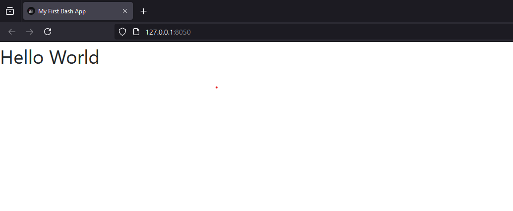
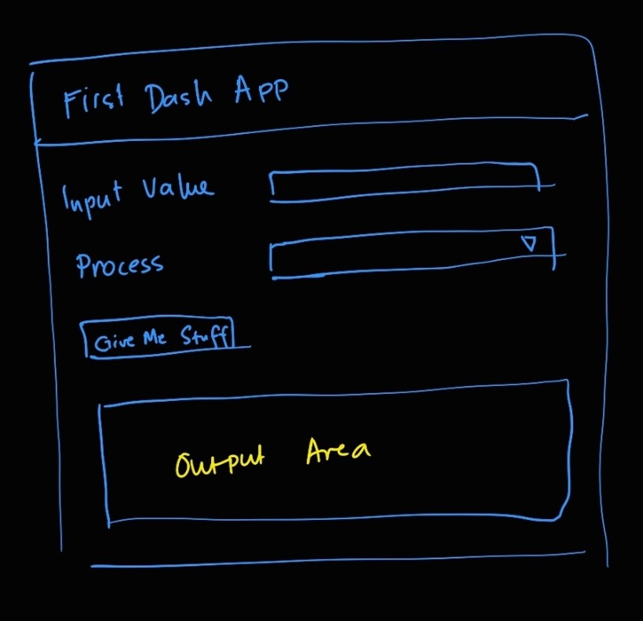
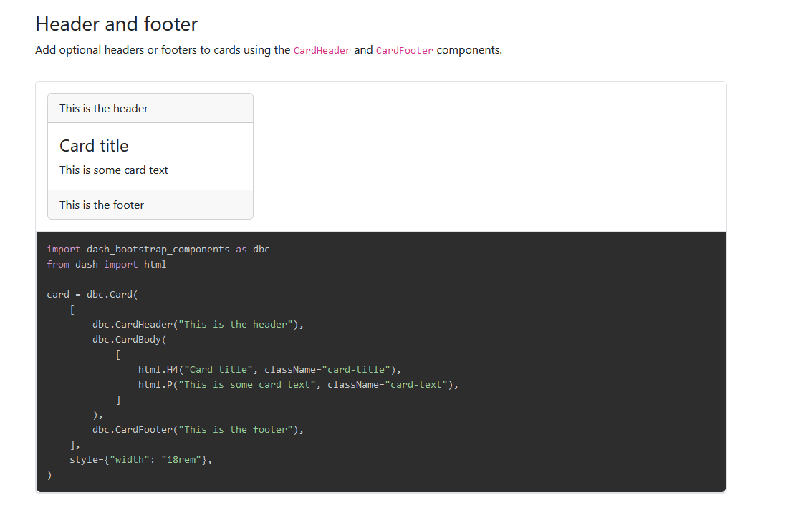
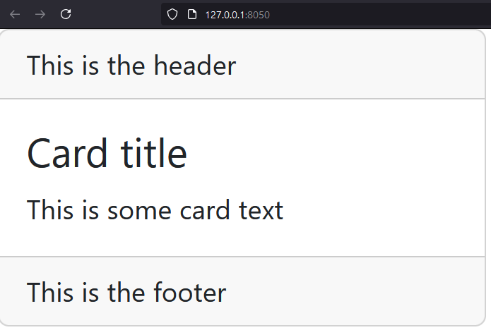
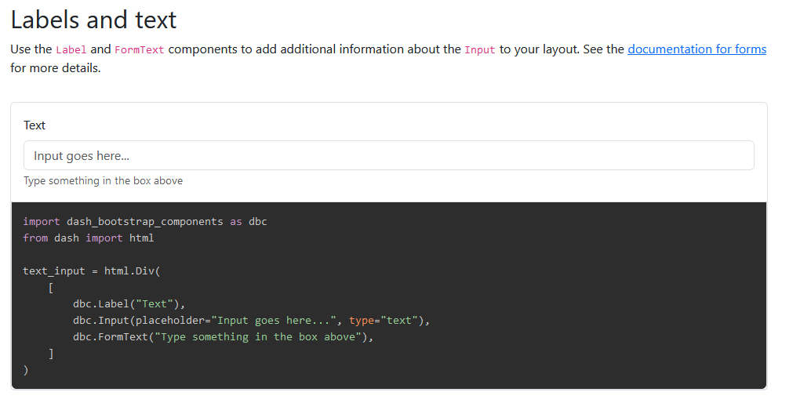
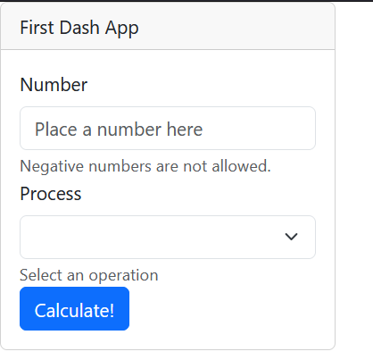

# Module 1b: Building your First Dash App
<!-- vscode-markdown-toc -->
* 1. [Preliminaries](#Preliminaries)
* 2. [Install Dependencies](#InstallDependencies)
* 3. [Setup your App File](#SetupyourAppFile)
* 4. [The `app.py` Code Structure](#Theapp.pyCodeStructure)
	* 4.1. [`import` Dependencies](#importDependencies)
	* 4.2. [Define your application object](#Defineyourapplicationobject)
	* 4.3. [Setup your App Title and Initial Layout](#SetupyourAppTitleandInitialLayout)
	* 4.4. [Run the Server](#RuntheServer)
	* 4.5. [Kill the Server](#KilltheServer)
* 5. [Specify this App's Functionalities](#SpecifythisAppsFunctionalities)
* 6. [Set up the Layout](#SetuptheLayout)
	* 6.1. [Adding more elements](#Addingmoreelements)
* 7. [Make the Components Interactive](#MaketheComponentsInteractive)
* 8. [Additional work to be done -- Challenge Yourselves!](#Additionalworktobedone--ChallengeYourselves)

<!-- vscode-markdown-toc-config
	numbering=true
	autoSave=true
	/vscode-markdown-toc-config -->
<!-- /vscode-markdown-toc -->

##  1. <a name='Preliminaries'></a>Preliminaries
You will need the following before we start.
* Internet connectivity
* A new folder in your workspace to contain scripts, `MyFirstApp`
  * All your codes should be inside this folder
* Open VS Code, ensure that the venv from Module 1a is active

##  2. <a name='InstallDependencies'></a>Install Dependencies
**Dependencies** are the packages that you need to make your project work. 

Open the terminal in VS Code through the menu, `Terminal > New Terminal`. With your venv active, execute each line of code below -- one-at-a-time.

```
pip install dash
pip install dash_bootstrap_components
```

* `dash` -- This is the package that provides us with functions to customize our application
* `dash_bootstrap_components` -- This is to make the application look better 

##  3. <a name='SetupyourAppFile'></a>Setup your App File
For this exercise, we will setup a single-page website. Create a blank script, `app.py`.

##  4. <a name='Theapp.pyCodeStructure'></a>The `app.py` Code Structure 

###  4.1. <a name='importDependencies'></a>`import` Dependencies
Start writing scripts in `app.py` by adding the packages needed for your application.

```python
import webbrowser

import dash
import dash_bootstrap_components as dbc
from dash import dcc, html
```
I know dash and dash_bootstrap_components.What are the others?
* `webbrowser` -- This has a function so we can open the web browser automatically when we run the app
* `dcc` -- This contains functions used to define interactive elements in code
* `html` -- This provides a way for us to add html elements to our app


###  4.2. <a name='Defineyourapplicationobject'></a>Define your application object

The application object, `app`, is defined by the following command:
```python
app = dash.Dash(__name__, external_stylesheets = [dbc.themes.BOOTSTRAP])
```

###  4.3. <a name='SetupyourAppTitleandInitialLayout'></a>Setup your App Title and Initial Layout

After defining your `app` as an application, we setup the title and the initial layout.

```python
app.title = "My First Dash App"

app.layout = html.Div(
	"Hello World"
)
```
The app title will showup on your browser's tab. In HTML, a Div is your basic container of elements (think, "division"). 

###  4.4. <a name='RuntheServer'></a>Run the Server
Write the scripts that will run the app.
```python
if __name__ == '__main__':
    webbrowser.open('http://127.0.0.1:8050', autoraise=True)
    app.run_server()
```
This command opens your default browser. 

Your app should now look like this:




###  4.5. <a name='KilltheServer'></a>Kill the Server

To restart the server, it has to be stopped first. 

While the app is running, focus on the terminal and do `Ctrl+C` or `Cmd+C` to kill the server. 


##  5. <a name='SpecifythisAppsFunctionalities'></a>Specify this App's Functionalities
Let's make the app actually do something. Setup a new py file `utilities.py` to contain the scripts below:
```python
def getFactorial(num):
	if num < 0:
		raise Exception("Number must be nonnegative")
	elif num <= 1:
		return 1
	else:
		return num*getFactorial(num-1) 


def generateFibonacci(num_elements):
	if num_elements <= 0:
		raise Exception("Fibonacci elements must be at least 1")
	elif num_elements == 1:
		return [0]
	elif num_elements == 2:
		return [0, 1]
	else:
		reference_fib = generateFibonacci(num_elements-1)
		return reference_fib + [reference_fib[-1] + reference_fib[-2]] 
```

The app shall have the following features:
* The app takes an input from the user via a textbox.
* The user selects which function from `utilities.py` will be used to process the input. Selection will be based on a dropdown list.
* A button will be used to confirm if selection is final.
* A section will be dedicated to containing the outputs.

Interface Mockup




##  6. <a name='SetuptheLayout'></a>Set up the Layout

To modify the layout of the application, we have to modify the definition to the `app.layout` variable. 

We have two references for adding elements into the web page:
* `html` [ref](https://dash.plotly.com/dash-html-components) (dash) -- for generic HTML elements (div, span, etc)
* `dbc` [ref](https://dash-bootstrap-components.opensource.faculty.ai/docs/components/) (dash_bootstrap_components) -- for interactive form elements (text boxes, dropdowns, etc)

Regarding the main container of the mockup, the element looks much like a `dbc.Card` [ref](https://dash-bootstrap-components.opensource.faculty.ai/docs/components/card/) element. Click the link to the reference and copy the code pictured below. 



Using the copied scripts, your `app.layout` should look like the following:

```python
app.layout = html.Div(
    [
        dbc.Card(
            [
                dbc.CardHeader("This is the header"),
                dbc.CardBody(
                    [
                        html.H4("Card title", className="card-title"),
                        html.P("This is some card text", className="card-text"),
                    ]
                ),
                dbc.CardFooter("This is the footer"),
            ],
            style={"width": "18rem"},
        )
    ]
)
```

Things to take note: 
1. All functions with `html.` and `dbc.` are functions that work as **HTML wrappers**.
2. The contents of a wrapper are referred to as `children`.
3. A wrapper can contain other wrappers.
4. If a container has multiple children, enclose them in square brackets `[]`, 

At this point, you can run your `app.py` again to check the contents. 




By comparing the code and the image, we can now associate where the texts should go. Let's try to get closer to the mockup. Here are things to do. 
* Edit the card header.
* Replace the card body contents. Add placeholders fields inside the form.
* Remove the footer

Check the scripts below for the modified version.

```python
app.layout = html.Div(
    [
        dbc.Card(
            [
                dbc.CardHeader("First Dash App"),
                dbc.CardBody(
                    [
                       "input value", 
                       "process selection", 
                       "button", 
                       "output area"
                    ]
                ),
            ],
            style={"width": "18rem"},
        )
    ]
)
```

###  6.1. <a name='Addingmoreelements'></a>Adding more elements

To add the other elements, we go through the `dbc` [reference page](https://dash-bootstrap-components.opensource.faculty.ai/docs/components/) (click link). 

For input components, click on `Input` from the sidebar. Find a peg and place them inside `app.layout`. For this project, we're using the one below.



We would also like to add a dropdown. Proceed to find the Select element from the same page of the documentation. 

After adding these input fields, we have the following for the `dbc.CardBody` element. 

```python
                dbc.CardBody(
                    [
                        html.Div(
                            [
                                dbc.Label("Number"),
                                dbc.Input(placeholder="Place a number here", type="text", id='num_input'),
                                dbc.FormText("Negative numbers are not allowed."),
                            ]
                        ), 
                        html.Div(
                            [
                                dbc.Label("Process"),
                                dbc.Select(
                                    id="process_select",
                                    options=[
                                        {"label": "Get Factorial", "value": 1},
                                        {"label": "Generate Fibonacci", "value": 2},
                                    ],
                                ),
                                dbc.FormText("Select an operation"),
                            ]
                        ), 
                       "button", 
                       "output area"
                    ]
                ),
```

Things to note:
1. For the dropdown/select, we simply copied the first Div and replaced the `dbc.Input()` part.
2. For elements that will be interactive (i.e. input fields, output areas), the argument `id` must be added. Values for `id` must be unique.

Now, you know the drill. Let's add a `dbc.Button()` for the "button" and for the output area, let's just put in a `html.Div()`

Here's the resulting script. 

```python
                dbc.CardBody(
                    [
                        html.Div(
                            [
                                dbc.Label("Number"),
                                dbc.Input(placeholder="Place a number here", type="text", id='num_input'),
                                dbc.FormText("Negative numbers are not allowed."),
                            ]
                        ), 
                        html.Div(
                            [
                                dbc.Label("Process"),
                                dbc.Select(
                                    id="process_select",
                                    options=[
                                        {"label": "Get Factorial", "value": 1},
                                        {"label": "Generate Fibonacci", "value": 2},
                                    ],
                                ),
                                dbc.FormText("Select an operation"),
                            ]
                        ), 
                        dbc.Button("Calculate!", id='btn_calculate', color='primary', n_clicks=0),
                        html.Div(id='output_area')
                    ]
                ),
```
Things to note:
1. The button and the div are both interactive. We expect a response from these elements.
2. The div has no children, but it must have an `id` since it is interactive. 
3. We specify the argument `n_clicks = 0` for the button to initialize its clicked state.

Here's our layout now. 



It does not look very nice, but that's okay. Making things pretty is for another time. 

##  7. <a name='MaketheComponentsInteractive'></a>Make the Components Interactive

You can click on stuff now but they do not work yet. To make them interactive, we need to define an [app callback](https://dash.plotly.com/basic-callbacks).

Update your imports!

```python
from dash import dcc, html, Input, Output, State, callback
from dash.exceptions import PreventUpdate
```

A callback has 3 parts: Input, Output, and State
* An `Input` element **triggers a function** when its value is altered.
* An `Output` element is **updated based on the return value** of the triggered function.
* A `State` element is a **value that is passed** into the triggered function. This is an optional element.

Each of these elements require 2 arguments: `element_id` and `property`:
|              | Input                                                            | Output                                   | State                                            |
| ------------ | ---------------------------------------------------------------- | ---------------------------------------- | ------------------------------------------------ |
| `element_id` | The `id` of the triggering element                               | The `id` of the element to be updated    | The `id` of the element whose value is extracted |
| `property`   | The change on this argument of the element triggers the function | This argument is updated for the element | The value of this argument is extracted          |


So, for our case, what do we want to happen?

> If the **button is clicked**, we use the values in **num_input** and **process_select** to display the result as children of **output_area**.

Here is the resulting callback. Put it **after** defining the `app.layout` but before running the server.

```python
@callback(
	[
		Output('output_area', 'children')
	],
	[
		Input('btn_calculate', 'n_clicks')
	], 
	[
		State('num_input', 'value'), 
		State('process_select', 'value')
	]
)
```

Right below the callback, define the function that will execute whatever the procedure is. Here is the structure of this function.
```python
@callback(
	[
		Output('output_area', 'children')
	],
	[
		Input('btn_calculate', 'n_clicks')
	], 
	[
		State('num_input', 'value'), 
		State('process_select', 'value')
	]
)
def calculateResults(btncalculate_clicks, num_input, process_select):
	# do something
	return [output values]
```

The way we assign values to the arguments of the function `calculateResults()` is positional. 
* `btncalculate_clicks` gets its value from `Input('btn_calculate', 'n_clicks')`
* `num_input` gets its value from `Input('num_input', 'value')`
* `process_select` gets its value from `Input('process_select', 'value')`


Let's complete the function. Import utilites first. 

```python
from utilities import generateFibonacci, getFactorial

@app.callback(
	[
		Output('output_area', 'children')
	],
	[
		Input('btn_calculate', 'n_clicks')
	], 
	[
		State('num_input', 'value'), 
		State('process_select', 'value')
	]
)
def calculateResults(btncalculate_clicks, num_input, process_select):
    if btncalculate_clicks > 0:
        num_input = int(num_input)
        process_select = int(process_select)

        if process_select == 1:
            factorial_value = getFactorial(num_input)
            output_val = str(factorial_value)

        elif process_select == 2:
            fib_sequence = generateFibonacci(num_input)
            fib_sequence_str = [str(i) for i in fib_sequence]
            output_val = ", ".join(fib_sequence_str)
            
        else:
            raise PreventUpdate

    else:
        raise PreventUpdate
    
    return [output_val]
```

Things to note
* We convert `num_input` and `process_select` into integers mainly because they became strings when the function executed
* All children of divs should be strings. Hence, note that we processed the function values further so they could become strings. 
* The `return` is always enclosed in square brackets. 

##  8. <a name='Additionalworktobedone--ChallengeYourselves'></a>Additional work to be done -- Challenge Yourselves!

1. Currently, the program assumes that all inputs are valid. In case the inputs are invalid, let the application tell the user of their error via the output area. 
2. Format the output strings. 
   1. The factorial displays "The factorial is ___."
   2. The generator displays "We get the sequence _____."

