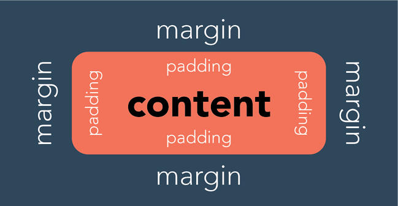
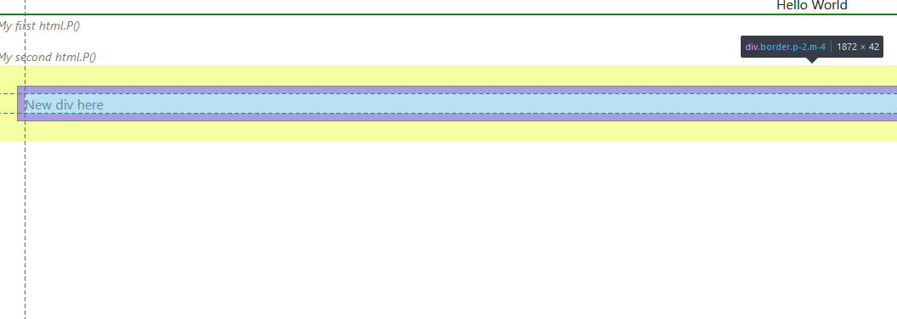

# Module 1c: CSS Notes
<!-- vscode-markdown-toc -->
* 1. [Preliminaries](#Preliminaries)
* 2. [Custom Style Sheets](#CustomStyleSheets)
* 3. [External Stylesheets](#ExternalStylesheets)
* 4. [Using CSS Classes](#UsingCSSClasses)
* 5. [Creating CSS Classes](#CreatingCSSClasses)
* 6. [Layouting](#Layouting)
	* 6.1. [Container Divs](#ContainerDivs)
	* 6.2. [Units of Measures](#UnitsofMeasures)
	* 6.3. [Grid](#Grid)
	* 6.4. [Flex Boxes](#FlexBoxes)

<!-- vscode-markdown-toc-config
	numbering=true
	autoSave=true
	/vscode-markdown-toc-config -->
<!-- /vscode-markdown-toc -->

##  1. <a name='Preliminaries'></a>Preliminaries

1. Internet connection
2. Download and copy the assets folder inside `MyFirstApp`

##  2. <a name='CustomStyleSheets'></a>Custom Style Sheets

Cascading Style Sheets (CSS) are basically used to style HTML elements. In Dash, you can simply add CSS codes via the `style` argument. Try this by modifying your app.layout definition into the following:
```python
app.layout = html.Div(
    [
        html.Div(
            'Hello World',
            style={'border': '2px solid green'}
        )
    ]
)
```
* The `border` is known as a CSS property that you can alter to setup how an element looks like
* The other side of the pairing is known as the `value` for the property.


We will not be discussing all the possible CSS properties -- they are actually easily searchable on the internet according to your use cases.

##  3. <a name='ExternalStylesheets'></a>External Stylesheets
In the previous version of your application, you used a stylesheet that came with your import of `dbc`. To customize it, we setup the `assets` folder which contains `bootstrap.css` that you can modify to your liking.

In the `bootstrap.css` file, you can find the CSS properties for the HTML elements. when you scroll down, you can also find that some names are prefixed with a `.` -- these are called classes.

##  4. <a name='UsingCSSClasses'></a>Using CSS Classes

You can definitely use the classes in `bootstrap.css` into your work. Let's use `w-100` and `text-center` so we can put `Hello World` in the middle of the div. 

Put these two classes into the `className` argument of the div of interest. 

```python
        html.Div(
            'Hello World',
            style={'border': '2px solid green'},
            className='w-100 text-center'
        )
```

Here are some of my most used classes:
* `p-auto`
* `m-auto`
* `text-center`
* `fw-bold`

##  5. <a name='CreatingCSSClasses'></a>Creating CSS Classes
In programming, we do not like coding the same thing more than once. Custom CSS classes can be created for elements in your page that are repetitive. Something that I like to keep in my projects is:

```css
.placeholder-text{
    color: #777;
    font-style: italic;
    font-size: 90%;
}
```
As practice, these custom classes are placed not inside `bootstrap.css` so that we can better track these add-ons. Follow these instructions to setup your `customcss.css`.

1. Create `customcss.css` inside `assets`
2. Copy and paste the class definition above

Add 2 html.P() elements the `placeholder-text` class so your app looks like this now:


##  6. <a name='Layouting'></a>Layouting

In this section, we will learn the common concerns in layouting. \

###  6.1. <a name='ContainerDivs'></a>Container Divs
Container divs all have configurable spaces around them that we can use to layout and add whitespace between elements. 



Let us use these margins and use a border to visualize them. Add this element to your layout, below all the existing elements.

```python
        html.Div(
            "New div here",
            className='border p-2, m-4'
        )
```

Analyze the webpage using the developer tools on your browser. Press `F12`. 



You can highlight your elements and tryout some combinations of settings via the developer tools. You could also learn to read HTML here as well.

###  6.2. <a name='UnitsofMeasures'></a>Units of Measures

[Reference] (https://www.freecodecamp.org/news/css-unit-guide/)
* Absolute
  * `px` -- computer pixels
  *  `cm` -- around 37.8 px
  *  `mm` -- 1/10 of a cm
  *  `in` -- 2.54 cm
  *  `pt` -- points, equivalent to 4/3 px
*  Relative
   *  `em` -- relative to the font size of a parent unit
   *  `rem` -- root em. Based on the font size **of the entire webpage**
   *  `%` -- percentage of the parent unit
   *  `vw` -- 1% of the width of the viewing screen. 100vw covers entire screen width.
   *  `vh` -- 1% of the height of the viewing screen. 100vh covers the entire screen height.


###  6.3. <a name='Grid'></a>Grid

Placing divs side-by-side is a common problem for beginners. One way is to adapt a grid-like treatment to the containers. 

In a grid configuration, we have `dbc.Row()` that contain `dbc.Col`. Rows can expand to fill the entire screen, but each row can only have a maximum width of `12` units. 

Add these elements to your layout. 
```python
        dbc.Row(
            [
                dbc.Col('R1C1, width = 8', width=8, className='border'),
                dbc.Col('R1C2, width = 4', width=4, className='border'),
            ]
        ),
        dbc.Row(
            [
                dbc.Col('R2C1, width = 2', width=2, className='border'),
                dbc.Col('R2C2, width = 2', width=2, className='border'),
            ]
        )
```

###  6.4. <a name='FlexBoxes'></a>Flex Boxes
Flex boxes offer another way to layout your divs side by side. 

```python
        html.Br(),
        html.Div(
            [
                html.Div("box1", className='w-25 border m-auto text-center'),
                html.Div("box2", className='w-25 border m-auto text-center'),
            ], 
            className='d-flex justify-content-between'
        )
```

* `d-flex` creates a flex display
* `justify-content-between` adds space between the components
* `m-auto` maximizes margins and centers the content
