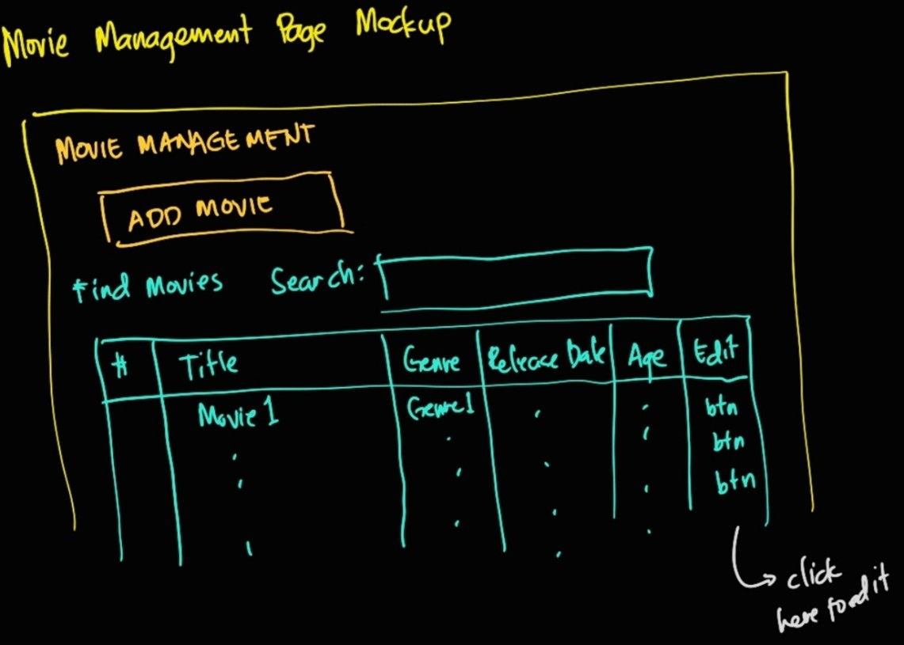

## Preliminaries
For this module, you will need the following:
* Your output from modules 2a and 2b
* Internet connection to download scripts from git.

## Mockups and Design
To organize our thoughts, we have some mockups that would serve as guides for our layout. 

### Workflow

### Movie Management Page

### Movie Form

## Creating a New Module

For code organization purposes, we create a folder inside `apps` for each set of pages that belong to a module. We will not setup the **movies module**. Do the following:

1. From github, download the contents of the folder `apps\movies\`
2. Create a `movies` folder inside `apps`. Paste the downloaded scripts inside `movies`.
3. Incorporate these new scripts into `index.py`
   1. Import the two new files in `index.py`
   2. Setup layouts per url
      1. If the url is `/movies/movie_management`, return the layout form `movie_management.py`
      2. If the url is `/movies/movie_management_profile`, return the layout form `movie_management_profile.py`

Test your codes by running the app. As you check the resulting layout, follow these notes:
* Associate the elements in both `movie_management` and `movie_management_profile` and the corresponding scripts that placed them there
* Determine the effects of the `className` properties for the elements. Find their effects in `bootstrap.css` and `customcss.css`.

## Callbacks for `movie_management_profile`
There are two callbacks for movie_management_profile. Try to challenge yourselves to analyze what they do. 

