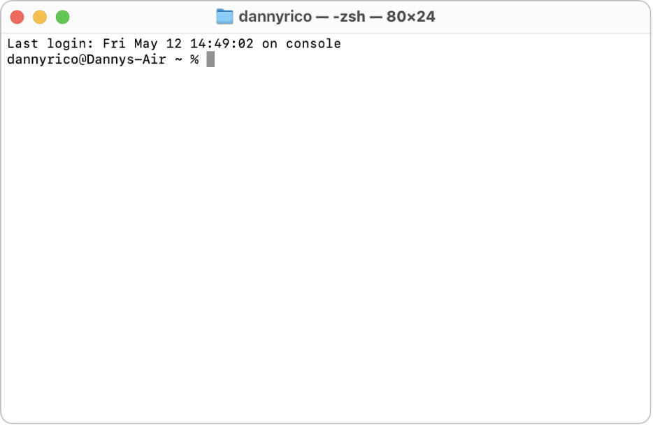

# Module 1A: Python Virtual environments
<!-- vscode-markdown-toc -->
* 1. [Preliminaries](#Preliminaries)
* 2. [Python Virtual Environments](#PythonVirtualEnvironments)
* 3. [Creating your First Venv](#CreatingyourFirstVenv)
	* 3.1. [Decide the location](#Decidethelocation)
	* 3.2. [CLI Basics](#CLIBasics)
	* 3.3. [Proceed to the Venv folder using the CLI](#ProceedtotheVenvfolderusingtheCLI)
	* 3.4. [Install `virtualenv`](#Installvirtualenv)
	* 3.5. [Create your venv](#Createyourvenv)
* 4. [Activate your Venv](#ActivateyourVenv)
	* 4.1. [What makes this venv new?](#Whatmakesthisvenvnew)
	* 4.2. [Activate the Venv](#ActivatetheVenv)
		* 4.2.1. [Windows](#Windows)
		* 4.2.2. [Mac](#Mac)
* 5. [Setting up on VS Code](#SettinguponVSCode)

<!-- vscode-markdown-toc-config
	numbering=true
	autoSave=true
	/vscode-markdown-toc-config -->
<!-- /vscode-markdown-toc -->

##  1. <a name='Preliminaries'></a>Preliminaries
For this section, you will need access to the following
* Internet connection 
* Access to CLI Terminals (Windows Powershell, Mac OS Termina, CMD)


##  2. <a name='PythonVirtualEnvironments'></a>Python Virtual Environments
Generally, a **Python Virtual Environment** is an isolated space within your computer where you can work on your Python projects -- separately from your system-installed Python [^1]. 

**Why?**

In web development, all projects do not have the same dependencies or packages (see imports). Some projects will require `pandas`, some projects don't. Some projects need special packages for AI, some do not.

**Why?**

To deploy a web application, you have to configure a *virtual Machine* based on the Python settings of your project. A virtual machine (VM) is a remotely accessible computer -- usually connected to a network for web deployment. When a VM is created for a project, it is literally a computer with no applications, only the operating system. You will need to install the required applications.

**How does a Python Environment help with that?**

When a virtual environment is created, it is a *vanilla* Python -- i.e. no configurations, no installed dependencies. You get to start from scratch and you get to track your configurations. It's like cloning your Python for each project that you have so you know what goes on in each project. 


##  3. <a name='CreatingyourFirstVenv'></a>Creating your First Venv
Follow these steps to create your first virtual environment (venv).
###  3.1. <a name='Decidethelocation'></a>Decide the Location
Create a location for your venv. 
Personally, I put it in a folder away from my py scripts. Usually, you share the folder with py scripts with your co-developers, but you do not share the folder with your venv.

Pick a convenient location in your PCs. For me, I have a fixed location for venvs. 


For demo purposes, I have `D:\vevs\` as a directory for my venvs.

###  3.2. <a name='CLIBasics'></a>CLI Basics
Open your preferred CLI (CMD, Windows Powershell, Mac OS Terminal). For MacOS users, search for the Terminal App. For Windows, search for PowerShell. 

A terminal is basically a file explorer but instead of clicking icons, you enter commands. When you open a terminal, you get the following view. 


You get this for Windows.



This one from MacOS. (Photo grabbed from Apple Support)

You can see hear that you are at a particular directory. For the PowerShell screenshot, we have `Users` while we have `Dannys-Air` for the Terminal one.

Basic commands you should know
* `ls` -- Lists the contents of the current directory
* `cd <path>` -- changes directory to the specified path. Path can simply be a folder name inside the current directory
* *`cd ..` -- Go up one folder above.

###  3.3. <a name='ProceedtotheVenvfolderusingtheCLI'></a>Proceed to the Venv folder using the CLI
First, get the path to your venv folder. The easiest way to do this is via your file explorer. 

Locate your folder and `right-click > Copy as Path`. 

Proceed to your terminal and type the following
```
cd "<path>"
``` 
Replace `<path>` with the path you copied. The double-quotes may be important here.
After pressing Enter/Return, you get the following. 


###  3.4. <a name='Installvirtualenv'></a>Install `virtualenv`

The package `virtualenv` creates your Venvs for you. Installing it requires the Internet.

On your Terminal, type the following:

```
pip install virtualenv
```

MacOS users may require `pip3` instead of `pip`.

###  3.5. <a name='Createyourvenv'></a>Create your venv
Creating virtual environments has the following syntax:

```
virtualenv <environment_name>
```
The environment name is used for quick identification. 

Let's create your new venv. Run the following scripts. 
```
virtualenv ie172_lectures
```

This might take a while. It's done when the cursor starts blinking again. You may also verify this by running the following on your terminal:
```
ls
```

Or, just checking your file explorer for a new folder named `ie172_lectures`

##  4. <a name='ActivateyourVenv'></a>Activate your Venv
###  4.1. <a name='Whatmakesthisvenvnew'></a>What makes this venv new?
As mentioned earlier, venvs are "clean clones" of Python. To compare, execute the following to show the installed dependencies in your system-installed Python. 
```
pip freeze
```
*MacOS might use `pip3`

For my case, here are the dependencies. 


Take note of these outputs. 

###  4.2. <a name='ActivatetheVenv'></a>Activate the Venv

####  4.2.1. <a name='Windows'></a>Windows
For Windows users, want to run the `activate` file inside your venv folder. Generally, it's in the following directory 
```
<venvname>/Scripts/activate
```

If you run `ls` and your venv folder is there, simply run the script above -- remember to replace the appropriate venvname.

####  4.2.2. <a name='Mac'></a>Mac
Make sure that when you run `ls`, your venv folder shows up. Here's your syntax to activate your venv.
```
source <venvname>/bin/activate
```

`source` simply means to execute the specified file in the given directory.


For either OS, you know that the venv is activated when you have the venvname near the cursor.


With your venv active, run `pip freeze`. What's the difference?

All py files run via this terminal instance will now use the venv as its Python.

### Deactivating a Venv

When a venv is active, run the following to deactivate it. 
```
deactivate
```

Any py files run from now on will use the system-installed Python.


##  5. <a name='SettinguponVSCode'></a>Setting up on VS Code

When you activate a venv, it's only active *for that window*. VS Code assists us so that whenever we open a project or workspace, it retains the activation of a venv.

### Open your VS Code Workspace

If you don't have a workspace yet, open VS Code and your folders. Proceed to `File > Save Workspace As...` then click Save. 

*Why do we like workspaces?* These workspaces come in handy when we have projects with specific setups. When it comes to venvs, different projects have different venvs. Workspaces save us time by remembering the venvs for each workspace. 

### Select a Python Interpreter
A **Python Interpreter** is a Python *instance* that is used to execute Python programs. We now know that a PC can have many Python instances. 

In VS Code, you may start by opening the Command Palette by `Ctrl-Shift-P` or `Cmd-Shift-P`. Type in `Interpreter`. Select `Python: Select Interpreter`.


Pick `Enter interpreter path` > `Find`. 

Locate your venv folder, then select the following file: `Scripts/python`


### Verify the Interpreter

For this one, open or create a py file. The active Python interpreter should be reflected at the bottom status bar. 


## Add on: VS Code Terminal

VS Code also has a terminal -- same terminal as the one you used before but inside VS Code. When working on projects, this can be convenient to use because of the following:
* venv is automatically active (if your workspace has a venv)
* It automatically points to your project directory

[^1] https://www.geeksforgeeks.org/python-virtual-environment/
[^notes] All these scripts were tailor-fit to the needs of the course. 